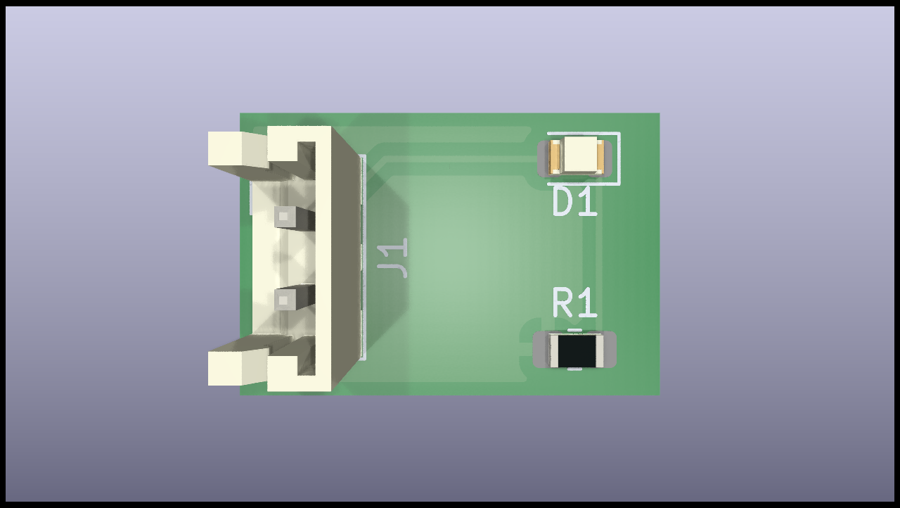
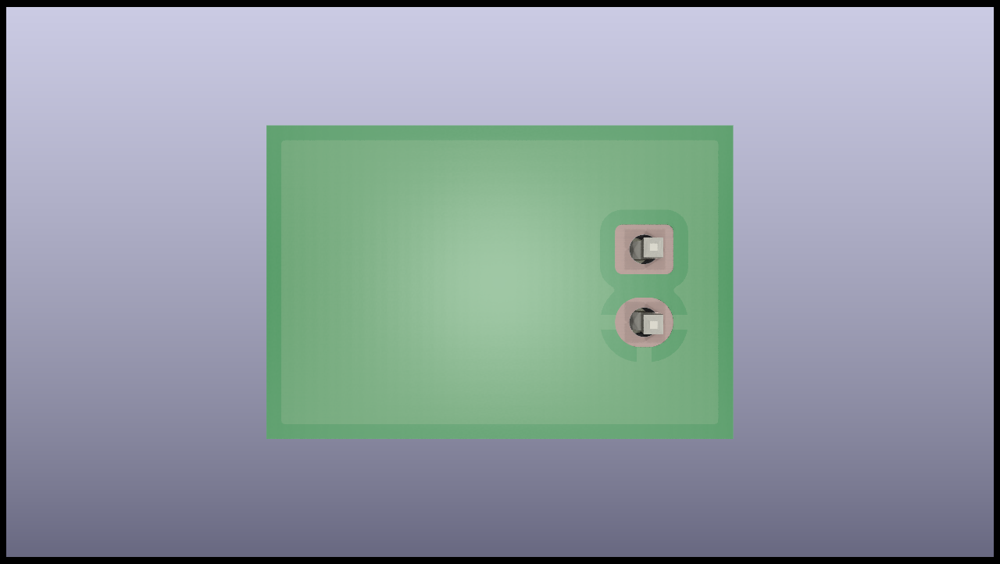

# Kibot Test
## By Florian "FloRide" Reimat

## About
This repo is a test about a Kicad Plugins named "[KiBot](https://github.com/INTI-CMNB/kibot)", an all in one plugins made for automatically generate export files like BOM / Cost / Gerber / etc... It also handle CI / CD with Github / Gitlab.

## Images:
### Schematic:

### PCB:
| Front | Bottom |
:------:|:-------:
|| |
### 3D:
| Front | Bottom |
:------:|:-------:
|| |
| Tilted 1 | Tilted 2 |
|  |  |

## Others:
- [Interactive BOM](Export/ibom/KibotTest-ibom.html)
- [BOM](Export/bom/KibotTest-bom.csv)
- [Cost](Export/cost/KibotTest-kicost.xlsx)
